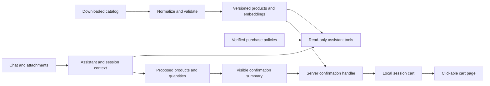

# EKT assistant — implementation and acceptance plan

Date: 23 September 2026  
Status: planned work; completion must be recorded with verification evidence.  
Scope: the client prototype, using the downloaded EKT catalog, embeddings for semantic search, and a local session cart.

## 1. Outcome and scope

Deliver a Russian-language chat in which a customer can ask about a product, stock, technical characteristics, certificates, alternatives, and purchase terms; upload a photo or document; review selected products and quantities; explicitly confirm an addition; and open a cart containing exactly the confirmed items.

The client brief permits a catalog export or test API access and permits a representative or synthetic catalog for development and demonstration. Downloading EKT data and building an embedding index satisfies that data-access approach. A live catalog request on every message is unnecessary.

The local cart is the agreed prototype implementation. It must have real application state and a working link, and must be identified as a demonstration cart. It does not reserve warehouse stock or place an order. Connecting it to the production EKT basket is a separate deployment task if the client later requests it. Compatibility with the existing website remains a required design and integration consideration; production compatibility cannot be claimed before the platform is known and tested.

### Required scope

- Catalog answers grounded in structured snapshot records.
- Reliable lookup by article, identifier, name, and natural-language description.
- Relevant available alternatives, with reasons and known differences.
- Sourced answers about payment, delivery, and product-specific minimum quantities.
- Explicit, proposal-specific confirmation before every cart mutation.
- Quantity and stock checks, including quantities already in the cart.
- A direct, clickable link to the current session cart after additions.
- JPEG/photo, PDF, Word, and Excel inputs; CSV remains supported.
- Context within a session, desktop and mobile usability, privacy controls, and useful failures.
- Repository, setup instructions, architecture description, data description, and reproducible acceptance evidence.

### Deferred optional scope

Kazakh language, companion-product recommendations, account-based permanent conversation history, and automated manager handoff are optional in the brief. Complete the required scope before adding these. A sourced contact link or a truthful request to consult a manager can be used when the catalog cannot answer a question without implementing a handoff system.

## 2. Baseline and corrections to the audit

The current FastAPI application already contains catalog normalization, embedding search, model tools, file inputs, proposal/cart functions, a chat page, a cart page, and 16 passing tests from the audit run.

The earlier observation that the catalog was empty was time-specific. During follow-up inspection, the ongoing download contained 3,260 normalized products, including stock values; no built index was present at that inspection. The download is still changing, so implementation must measure coverage again before indexing and release.

Confirmed gaps:

- Text confirmation uses substring matching and accepts negative phrases.
- A confirmation is not bound to a unique, immutable proposal identifier.
- The model has a direct cart-mutation tool.
- Alternative selection relies on category and name overlap, with insufficient technical checks.
- Purchase terms are explicitly absent from the assistant instructions.
- Certificate fields may be lost by the CSV exporter even though the loader supports certificates.
- The UI does not consistently render useful product details and clickable source/certificate links.
- File conversion, session behavior, latency, and the complete chat flow lack acceptance coverage.
- Most application files are untracked, and the raw client documents are ignored by Git.

Recheck files before editing: the catalog downloader and its outputs are being worked on concurrently. Preserve existing user changes and coordinate any exporter changes with that work.

## 3. Architecture and ownership of decisions

Keep one FastAPI application and the existing static frontend. NumPy is sufficient for the prototype index until measurements demonstrate otherwise. Additional services, a vector database, and a frontend rewrite are unnecessary for these requirements.

The model interprets requests, calls read tools, and proposes a selection. Application code validates identifiers and quantities, calculates totals, binds confirmation to a selection, and performs the cart mutation. Model output, attachments, and catalog text never grant authorization.

Retain the current module boundaries where practical:

- `download_ekt.py`: catalog acquisition and preservation of source fields.
- `app/catalog.py`: normalization, units, certificates, warehouse data, and purchase constraints.
- `app/index_build.py`: embedding generation and publication of a consistent index.
- `app/search.py`: exact lookup, semantic ranking, details, and alternatives.
- `app/cart.py`: proposals, validation, confirmation, and cart state.
- `app/sessions.py`: session creation, expiry, context, and synchronization.
- `app/agent.py`: read tools, proposals, model interaction, and grounded answers.
- `app/main.py`: request validation, session protection, errors, and routes.
- `static/`: product cards, proposal controls, source links, uploads, and cart presentation.

Add small dedicated modules only where the responsibility needs one, such as purchase-policy lookup or attachment validation.

## 4. Requirement-to-delivery mapping

### R1 — Product information, stock, and certificates

Deliver exact article lookup, readable technical details, snapshot stock, warehouse breakdown where available, source/product links, and a certificate link when the record contains one.

Acceptance: a known article returns the same price, stock, and characteristics as its fixture/source record. A record with a certificate produces a usable link. Missing fields are described as unavailable; they are never filled with guesses.

Implemented through phases 2, 3, 6, and 7. Verified by A1–A4 and A13 below.

### R2 — Alternatives for unavailable products

Deliver candidates with available stock and relevant technical characteristics, plus a concise explanation of similarities and differences.

Acceptance: the designated zero-stock acceptance product has at least one valid available alternative and an explanation based on actual attributes. A catalog with no valid alternative returns that limitation rather than an unrelated recommendation.

Implemented through phase 4. Verified by A5–A6.

### R3 — Payment, delivery, and minimum quantities

Deliver a small, versioned policy knowledge source and product-specific purchase constraints.

Acceptance: questions about each of the three subjects receive substantive, sourced answers. Unknown location-dependent terms trigger clarification. Missing minimum-quantity data is stated honestly.

Implemented through phase 5. Verified by A7.

### R4 — Explicit confirmation and stock limits

Deliver a proposal-specific server authorization flow, strict quantity validation, expiry, retry protection, and stock checks.

Acceptance: questions, refusals, ambiguous replies, attachments, and model tool calls cannot mutate the cart. Confirmation adds only the displayed selection and never exceeds the snapshot allowance after accounting for the existing cart.

Implemented through phase 1. Verified by A8–A12.

### R5 — Direct cart link

Deliver a clickable link after both button and text confirmations, leading to the same session's current cart.

Acceptance: article, quantity, price, and totals on the cart page match the acknowledged addition. Another browser session cannot read or alter that cart.

Implemented through phases 1 and 7. Verified by A10 and A12.

### R6 — Supported inputs and session context

Deliver text, JPEG/photo, PDF, Word, and Excel handling with validation and session context sufficient for follow-up questions.

Acceptance: a supplied specification yields grounded catalog candidates and an explicit proposal; an image yields candidates or a clarification request; follow-ups refer to the right products. Neither input type grants consent.

Implemented through phase 6. Verified by A14–A16.

### R7 — Response time, privacy, compatibility, and artifacts

Deliver measured response times, bounded data retention, protected session endpoints, responsive UI, deployment guidance, and a reproducible repository.

Acceptance: performance evidence is recorded; session isolation and injection cases pass; desktop/mobile flows work; a fresh environment can follow the README and reproduce the acceptance scenarios.

Implemented through phases 7 and 8. Verified by A12 and A16–A20.

## 5. Phase 0 — Establish a reproducible baseline

Priority: required before implementation changes.

1. Record the current working-tree state and preserve uncommitted work.
2. Re-run the existing tests and record their result.
3. Inspect the active downloader state without stopping it or replacing its output.
4. Inspect a representative sample of actual records: stock types, price types, units, category paths, minimum-order properties, warehouse totals, and certificate locations.
5. Create small synthetic test fixtures with no customer information. Include:
   - Available product with known price, stock, technical properties, warehouses, and a test certificate link.
   - Zero-stock product with a technically suitable available alternative.
   - Superficially similar but incompatible product.
   - Unknown-stock and unknown-price products.
   - Product with a documented minimum quantity or purchase multiple.
   - Product with fractional units if those occur in the source.
6. Keep synthetic fixtures visibly separate from the real catalog and label them as test data.
7. Convert the client's acceptance checks into named tests before fixing the corresponding behavior.

Exit: baseline tests are recorded and fixtures cover the required success and failure paths.

## 6. Phase 1 — Make confirmation and cart mutation safe

Priority: first implementation work. Files: `app/cart.py`, `app/agent.py`, `app/main.py`, `app/sessions.py`, `static/chat.js`, cart/API tests.

### Proposal lifecycle

1. Give each proposal an unpredictable identifier, creation time, expiry, session owner, cart revision, and catalog version.
2. Store the exact selection: product identifiers, names/articles, quantities, units, unit prices, and total. Support multiple lines from a specification in one explicit review.
3. Treat proposals as immutable. Changing an item, quantity, or price creates a new identifier and invalidates the old proposal.
4. Permit one active proposal per session for the prototype. A new proposal replaces the earlier one and the frontend removes or disables its controls.
5. Use a configurable short expiry, initially 10 minutes. Re-display an expired selection for a fresh confirmation.
6. The client submits the displayed proposal identifier. The server never accepts replacement quantities or products from a confirmation request.

### Authorization

1. Remove the model's direct `add_to_cart` capability. Model tools can only propose.
2. Handle a clearly affirmative text command in server code against the proposal identifier displayed when that message was submitted.
3. Use full-message matching for a small set of explicit commands such as “да, добавь” and “добавить в корзину”. Do not authorize on substring matches, bare agreement, quoted examples, negation, conditionals, or mixed requests.
4. For “да, но сначала…” or a requested change, show a clarification or new proposal; the existing cart is unchanged.
5. Process confirmation before the model call, so the model cannot reinterpret consent, change the proposal, and spend the original confirmation.
6. Files and retrieved content never enter the authorization decision. An attachment-only message cannot confirm.
7. Make cancellation proposal-specific as well; an old cancel button must not cancel a newer selection.

### Validation and mutation

1. Validate finite positive quantities without silently truncating decimals or accepting booleans.
2. Validate units and documented minimum/multiple rules. Do not infer a packing rule solely from a product name.
3. Reject additions with unknown stock or unavailable purchase pricing. Show a clear explanation; do not turn a missing price into zero.
4. Aggregate duplicate product lines before checking stock.
5. Require existing cart quantity plus proposed quantity to be within the selected snapshot stock.
6. Re-read the current catalog record at confirmation. If a price or material purchase constraint changed, generate a fresh review instead of silently accepting different terms.
7. Reject an invalid batch as a whole; show which line needs correction. Avoid unexpected partial additions.
8. Serialize mutations for a session. Repeated clicks, retries, and concurrent requests must not apply the same proposal twice.
9. Retain a bounded set of completed proposal identifiers within the session. A retry returns a clear already-applied result and the current cart.
10. Calculate money with decimal arithmetic or integer minor units and apply one documented rounding rule.

Exit: adversarial confirmation tests, stale-button tests, concurrent/retry tests, and stock-boundary tests pass. Both confirmation routes return the same cart behavior.

## 7. Phase 2 — Produce a reliable catalog and embedding index

Priority: required for realistic catalog acceptance. Files: catalog loader, index builder, downloader where coordinated, configuration, ingestion tests.

### Preserve and normalize data

1. Read from a stable completed export or a consistent snapshot taken with the downloader's coordination mechanism. Never index a half-written CSV row.
2. Preserve identifiers, article numbers, product URLs, category, descriptions, structured properties, price, quantity, warehouses, unit, certificates, and available purchase rules.
3. Inspect certificate fields before modifying the exporter. Preserve top-level certificate links and links inside properties. Version any CSV schema change and support old exports during migration.
4. Normalize numeric fields explicitly; reject malformed or non-finite values. Preserve fractional stock if the product's unit allows it.
5. Keep missing stock distinct from zero stock. Do not assume that missing price means a free product.
6. Do not invent warehouse allocations or force inconsistent source totals to agree. Flag discrepancies in ingestion diagnostics.
7. Record snapshot provenance, capture time where known, product count, and coverage counts for stock, price, properties, and certificates. Distinguish export/import time from a supplier-provided observation time.
8. Report rejected records with identifiers and reasons, without logging credentials or customer content.

### Build and publish embeddings

1. Embed stable product descriptions: name, article, category, and useful technical attributes.
2. Read price and stock from structured records when answering; never use generated embedding text as their authority.
3. Retain the configured embedding model and record model name, vector dimension, normalization, content hash, and product order.
4. Batch requests with bounded retries and checkpoints. Cache successful embeddings by model and normalized content hash so interrupted builds resume and stock-only updates do not require re-embedding product descriptions.
5. Validate a nonempty product set, unique identifiers, finite vectors, correct shape, and exact correspondence between vector rows and products.
6. Write each build into a separate version directory and switch a small active-version manifest only after validation. Readers must never see products from one build and vectors from another.
7. Preserve the previous working version if a build fails. Prevent two builds from publishing over each other.
8. Define how the running application adopts a new complete version. Clear version-dependent search caches and validate pending cart proposals against the new records.
9. Expose readiness, active snapshot version, and catalog count without exposing secrets.

Exit: a real sample index loads successfully; exact lookup and semantic retrieval return its records; interrupted/invalid builds leave the prior version usable.

## 8. Phase 3 — Ground product answers and improve search

Priority: required for R1. Files: `app/search.py`, `app/agent.py`, product rendering, search tests.

1. Normalize article formatting consistently, including trailing underscores and case. Support a known article embedded in a sentence.
2. Use exact article/ID matches first and skip unnecessary embedding calls for an unambiguous exact lookup.
3. Use embeddings for free-form questions, product descriptions, and descriptions extracted from attachments.
4. Combine semantic relevance with category and explicit attribute constraints. Resolve duplicate/ambiguous article matches with the customer rather than selecting an arbitrary record.
5. Calibrate low-confidence behavior on the acceptance query set. Return a clarification or no-match result when appropriate; do not always fill a list with irrelevant products.
6. Add a bounded query-embedding cache keyed by model and normalized query. Keep result caches tied to the index version.
7. Retrieve full details before answering technical or certificate questions. Pass warehouse data and source provenance to the assistant.
8. Render authoritative price, stock, product attributes, and totals directly from structured payloads. Instruct the assistant to avoid unsupported facts and evaluate its answers against those payloads.
9. Always distinguish snapshot availability from a live reservation. Show the snapshot date when known.
10. Render supplied product and certificate links as clickable links using safe schemes and validated destinations. Treat a certificate path or identifier as unresolved until it has a usable location.
11. If a certificate is absent, say the catalog contains no certificate link; do not imply the product is uncertified.
12. Support follow-ups such as “а сколько в Алматы?”, “покажи сертификат”, and “чем отличаются первые два?” using explicit product identifiers from session context.

Exit: known article queries reproduce source facts, vague requests produce relevant candidates, and missing data is handled honestly.

## 9. Phase 4 — Make alternatives technically relevant and explainable

Priority: required for R2. Files: `app/search.py`, catalog normalization, optional small analog-rules module, analog tests.

1. Select candidates from the same product family with positive known stock.
2. Define category-specific comparison fields from the actual source:
   - Circuit breakers: poles, rated current, voltage, trip characteristics, mounting, breaking capacity where available.
   - Cables: conductor count, cross-section, material, voltage, and insulation/fire-performance properties where available.
   - Lighting: lamp/socket type, supply voltage, power, light output, color temperature, protection rating, and mounting where applicable.
3. Normalize equivalent unit spellings before comparison. Preserve original values for the explanation.
4. Reject contradictions in critical attributes. Missing essential attributes prevent a claim of verified interchangeability.
5. Distinguish a supported alternative from a merely similar item that needs an engineer/customer check. Do not label a similarity score as compatibility.
6. Rank eligible candidates by relevant shared properties and then semantic relevance. Price may be a secondary preference, never evidence of compatibility.
7. Generate the reason from compared fields: what matches, what differs, and what remains unknown. Avoid unexplained “same category” recommendations.
8. When there is no safe candidate, state that limitation and ask for the missing specification or suggest consulting the supplier.
9. Select an acceptance example with a genuine available alternative. The requirement for at least one analog does not justify inventing one when the catalog lacks it.

Exit: the designated unavailable product yields a relevant explained alternative, and intentionally incompatible fixtures are excluded.

## 10. Phase 5 — Add sourced purchase terms

Priority: required for R3. Planned files: `app/policies.py`, a small versioned policy file, agent tool definitions, policy tests.

1. Obtain payment and delivery terms from an official EKT page or a client-provided policy document.
2. Store concise structured facts with a source URL, verification date, geography, customer type, and any conditions.
3. Public EKT payment/delivery content was located during research, but a direct page fetch timed out. Re-fetch and verify the current visible terms before publishing exact fees, thresholds, or delivery promises. Do not treat a search snippet as final business-policy approval.
4. Add a read-only `get_purchase_terms` tool. Include source links with answers.
5. Ask whether the buyer is an individual or company and ask the delivery city when the answer depends on those details.
6. Read a product's minimum quantity or purchase multiple from verified catalog fields. Confirm the meaning of `KRATNOST_MIN` from sample/source data before treating it as both a minimum and a step.
7. If an actual minimum is unknown, explain which information is missing. Do not invent a universal minimum order.
8. Detect policy conflicts or expired review dates and direct the customer to the source/manager for the disputed term.
9. Do not collect card numbers, CVV, bank credentials, or payment authorization. Describe payment methods; checkout/payment remains outside the assistant.

Exit: payment, delivery, and minimum-quantity questions receive meaningful, sourced answers, including location-dependent clarification and truthful handling of missing rules.

## 11. Phase 6 — Complete attachment and conversation handling

Priority: required for R6 and privacy. Files: `app/agent.py`, request validation, session module, optional attachment helper, attachment/agent tests.

### Inputs

1. Validate file extension, declared MIME type, size, count, and recognizable file signature. Support JPEG and the documented PDF/Word/Excel formats; retain other image/CSV formats already supported where verified.
2. Set explicit limits: initially five attachments, 10 MB per file, 20 MB per request, and a bounded text-message length. Enforce total request limits during ingestion where possible and at the deployment proxy.
3. Reject empty, corrupted, encrypted, or unsupported inputs with a useful explanation. Do not silently ignore a spreadsheet sheet or document section.
4. Use model image inputs for photos and verified Responses API file inputs for supported documents. Run representative format tests against the configured model/account; a MIME list alone is insufficient evidence.
5. Extract requested items and quantities from specifications, resolve them against catalog records, and show unresolved lines separately.
6. Ask the customer to choose among ambiguous matches. Never invent an article, quantity, or stock value from an unclear image.
7. Present a multi-item review before any addition. Uploading an invoice or specification is a request for interpretation, not permission to buy.

### Context and privacy

1. Keep a bounded session history containing the text and product references needed for follow-ups.
2. Preserve original file bytes only for the processing request. Do not place raw uploads in session history, application logs, or the repository.
3. Keep useful non-sensitive extracted product references so follow-ups can refer to the attachment result without repeatedly sending the file.
4. Use application-controlled context and `store=false` where compatible with the Responses workflow. Verify the selected model's requirements for continuing tool calls without stored responses.
5. Explain that messages and attachments are sent to the configured AI provider. Do not claim that `store=false` eliminates every form of provider retention; account data controls are a separate consideration.
6. Show a concise instruction not to submit payment details. Reject recognizable payment credentials before forwarding when feasible; do not claim perfect sensitive-data detection.
7. Treat text inside files, catalog descriptions, and tool results as untrusted content. Instructions inside them cannot change assistant rules or authorize cart actions.
8. Bound model output, tool rounds, and session context. Store only the minimal useful result after processing.
9. Handle provider timeout/rate-limit/format errors without exposing stack traces, credentials, or raw request contents.

Exit: every required input type is tested with a representative file; session follow-ups work; malicious attachment instructions cannot change the cart; retention behavior is documented accurately.

## 12. Phase 7 — Finish API protection, UX, and performance

Priority: required for a usable demonstration. Files: API/session/configuration modules, static pages/scripts/styles, browser tests.

### Session and API behavior

1. Generate session identifiers on the server. Do not create a new session using an arbitrary caller-supplied identifier.
2. Use HttpOnly cookies, appropriate SameSite settings, Secure cookies under HTTPS, and explicit session expiry.
3. Start with a configurable idle expiry of two hours and a bounded session count. Expiry removes cart, proposal, and conversation state together.
4. Keep the prototype to one application worker if using in-memory state. Document that a restart clears sessions. Shared durable storage becomes necessary before deploying multiple workers or promising restart persistence.
5. Use an anti-CSRF token and origin validation for state-changing requests. Bind tokens and proposals to the session.
6. Serialize work that can change a session's proposal/history/cart. Avoid holding a global lock or blocking the async event loop during provider requests.
7. Return structured, safe errors for invalid input, missing index, provider outage, busy session, expired proposal, and stale catalog data.
8. Bound chat concurrency and per-session request rate. Provide a clear retry message rather than allowing unbounded provider calls.
9. Log request identifiers, timing, tool names, and outcome categories. Exclude messages, uploads, credentials, and session tokens from routine logs.

### Customer interface

1. Keep a single chat experience with readable product cards: article, name, price, stock, important attributes, source, and certificate link.
2. Label the local cart as a prototype and state that adding does not reserve stock.
3. Show each proposal with quantities, units, unit prices, total, and explicit confirm/cancel buttons.
4. Disable replaced, expired, cancelled, and completed proposals. Bind every control to its own identifier.
5. Return a clickable “Открыть корзину” link after either text or button confirmation. Do not rely on plain-text model output to render the link.
6. Preserve cart/proposal state after page refresh within the session. Restore bounded conversation history or clearly explain a new-session boundary.
7. Show attachment names, removal controls, accepted formats, size limits, and upload/processing states.
8. Handle failed submissions without losing the user's draft or allowing accidental duplicate additions.
9. Make the cart usable at narrow widths through wrapping or an intentional mobile row layout.
10. Verify keyboard navigation, focus, labels, screen-reader announcements, and readable contrast.
11. Test representative widths of 360 px, 390 px, 768 px, and desktop; include an actual mobile-browser check when available.

### Latency and website compatibility

1. Interpret the brief's “seconds” as a requirement for measured useful answers. A spinner or first token alone does not meet it.
2. Adopt an initial engineering target of p95 at or below five seconds for ordinary warmed-up text questions at the agreed demo load. This number is a proposed operational target, not an exact number supplied by the client.
3. Measure attachment latency separately by file type and size. Agree an acceptable bound for heavier documents and report any miss rather than declaring them compliant.
4. Measure at least exact article lookup, semantic search, policy answers, alternatives, and cart confirmation. Record p50/p95, failures, model, snapshot size, concurrency, and cold-start behavior.
5. Reduce avoidable provider calls through exact lookup, query caching, bounded tool rounds, and compact context.
6. Configure request deadlines and limited retries. Fast failure must not result in a fabricated success message.
7. Keep frontend asset names/styles contained and API configuration explicit so the chat can be hosted under an EKT-controlled origin later.
8. Document a same-origin/reverse-proxy integration approach and the required host settings. If embedding is requested, verify cookie, origin, CSP, and routing behavior against that actual host.
9. Do not expose catalog Basic Auth or AI credentials to the browser.

Exit: the full journey works on desktop/mobile, mutation endpoints enforce session ownership, and measured latency results are available with honest limitations.

## 13. Phase 8 — Acceptance testing and delivery

### Automated acceptance scenarios

- **A1 — Exact article:** a known article in a sentence returns the correct source record and no invented price or stock.
- **A2 — Technical details:** supplied attributes and warehouse quantities are preserved in the answer payload.
- **A3 — Certificate present:** a fixture certificate becomes a clickable valid link; unsafe URL schemes are rejected.
- **A4 — Missing fields:** unknown stock/price/certificate is represented honestly; no zero-price substitution.
- **A5 — Zero stock:** the designated unavailable product produces at least one suitable available alternative and a field-based reason.
- **A6 — Incompatible candidate:** a similar name with contradictory critical specifications is rejected; no-valid-alternative behavior is explicit.
- **A7 — Terms:** payment, city-dependent delivery, and minimum-quantity questions use the policy/catalog source; missing conditions cause clarification.
- **A8 — No consent:** questions, “я не согласен”, “не добавь в корзину”, quoted confirmations, conditional replies, and attachments do not mutate the cart.
- **A9 — Bound consent:** confirmation for an old/replaced/expired proposal cannot add the current proposal. A changed-price proposal requires fresh consent.
- **A10 — Correct addition:** button and text confirmation add exactly the displayed lines and return a usable cart link.
- **A11 — Quantities:** zero, negative, non-finite, malformed, boolean, unsupported fractional, over-stock, and rule-violating quantities are rejected; duplicate lines are aggregated.
- **A12 — Isolation and concurrency:** one session cannot confirm another's proposal; CSRF failures are rejected; double-clicks/retries/concurrent confirmations apply at most once.
- **A13 — Index lifecycle:** empty/corrupt/mismatched builds fail clearly; interrupted builds preserve the active index; model/dimension mismatch is detected.
- **A14 — Required files:** JPEG, PDF, Word, and Excel fixtures produce useful catalog-backed results; unsupported/corrupt/oversized files have clear errors.
- **A15 — Conversation:** follow-up questions and references to earlier products resolve correctly within the bounded session.
- **A16 — Untrusted instructions:** a document or product description requesting an unauthorized addition cannot bypass confirmation.
- **A17 — Provider failures:** timeout, rate limit, and malformed tool arguments leave the cart unchanged and return safe errors.
- **A18 — Browser journey:** search, detail/certificate view, proposal, refusal, confirmation, cart link, refresh, and mobile layout all work.
- **A19 — Performance:** publish measurements against the proposed target; identify every unverified or missed case.
- **A20 — Clean setup:** a fresh environment can install, load the sample/downloaded data, build the index, run the app, and execute tests using the README.

### Verification layers

1. Unit tests for normalization, rule enforcement, confirmation recognition, money/quantity arithmetic, analog filtering, and policy selection.
2. API tests for session/CSRF ownership, proposal identifiers, repeated/concurrent requests, and cart state.
3. Agent orchestration tests with deterministic fake model responses, including malicious or malformed tool calls.
4. Browser tests for the actual customer journey and responsive layout.
5. A small real-model smoke suite with representative product queries and each required file type. Keep it separate from offline tests because it requires credentials, incurs API usage, and can vary.
6. A fixed evaluation set of approximately 30 realistic Russian questions covering the five must-haves, ambiguous queries, and follow-ups. Manually check technical relevance and factual accuracy against source records.
7. A measured performance run using a documented catalog/model/environment.

Deterministic tests must enforce invariants; passing mocked tests alone cannot establish real-model answer quality, attachment compatibility, or latency.

### Repository and documentation

1. Include application code, tests, safe fixtures, dependency declarations, sanitized configuration examples, this plan, and the README in the deliverable.
2. Keep secrets, full partner exports, uploads, and generated indexes out of Git unless a specific safe redistribution decision is made.
3. The supplied raw API document contains credentials. Do not simply remove the ignore rule for all of `docs/`; create a sanitized requirements/integration summary for sharing.
4. Document environment variables with empty credential values, including catalog credentials if downloading is part of setup.
5. Document download/resume, index build/resume/rebuild, readiness checks, server launch, test commands, and troubleshooting.
6. Describe snapshot freshness, local cart semantics, supported units/formats, source-policy dates, session expiry, provider data handling, and the single-worker deployment constraint.
7. Provide a demo script covering all five must-haves plus uploads, refusal, and mobile use.
8. Record test results and remaining limitations in a short acceptance report. Do not mark unexecuted checks as passed.

Exit: a reviewer can reproduce the prototype and inspect evidence for every required behavior.

## 14. Delivery order and dependencies

1. **Milestone 1: safe cart foundation.** Complete phases 0 and 1. This work can proceed while the catalog download continues.
2. **Milestone 2: usable catalog answers.** Complete phases 2 and 3 using a stable snapshot. Validate a real query before expanding the dataset.
3. **Milestone 3: complete consultation.** Complete phases 4 and 5. Select valid analog acceptance examples and publish verified purchase-policy sources.
4. **Milestone 4: complete customer journey.** Complete phases 6 and 7, including uploads, context, confirmation controls, source links, and mobile behavior.
5. **Milestone 5: client acceptance package.** Complete phase 8 and record the release gate below.

Policy-source verification can happen while indexing work proceeds. Attachment fixtures and acceptance definitions can be prepared before real-model testing. Keep code changes small enough to review and verify per milestone.

## 15. Open inputs and how to handle them

- **Catalog completeness:** a representative sample is permitted. Record actual coverage and use a stable snapshot rather than waiting for every product.
- **Certificate availability:** inspect real fields; test presence using a clearly synthetic fixture. If no real certificate exists in the supplied data, report that limitation without inventing a document.
- **Minimum quantity and units:** verify field meaning before enforcing it. Display unknown constraints and request clarification where necessary.
- **Payment/delivery policy:** obtain a retrievable official source or client-approved document. This is required for complete purchase-terms acceptance.
- **Latency:** five seconds is an initial engineering target; attachment expectations and demo concurrency need explicit measurement and, if necessary, client clarification.
- **Production website platform:** not a blocker for the agreed local prototype. Needed before claiming production embedding/basket compatibility.
- **Model/account support:** verify the configured model supports the required tool and file inputs in the actual account. Do not silently switch models when access fails.

These inputs do not prevent implementing confirmation, data validation, search, UI, and deterministic tests. Any input still unresolved at delivery must appear as a limitation against the relevant acceptance scenario.

## 16. Release gate

The prototype is ready for client demonstration only when:

- All five must-have scenarios pass against the selected catalog and verified policy source.
- Negative, ambiguous, stale, repeated, and cross-session confirmation cases cannot cause unintended cart mutations.
- Confirmed quantities and totals match the displayed proposal and stay within snapshot stock and known purchase rules.
- Product facts and certificate/policy links are traceable to actual sources.
- Each required attachment type has been exercised; unsupported cases are accurately stated.
- The complete chat-to-cart journey works on desktop and mobile.
- Useful-answer latency has been measured and any unmet target is disclosed.
- Repository setup and the demo script work from a clean environment.
- The acceptance report distinguishes passed checks, external dependencies, and remaining limitations.

## 17. Reference sources

- Client requirements: `docs/HackAlem AI_ ИИ-ассистент для чата на сайте ekt.kz.md`, especially inputs/outputs, data, must-haves, constraints, and artifacts.
- Supplied API access document: use locally for catalog access; never copy its credentials into this plan or public documentation.
- EKT purchase-policy source candidate: [official EKT page](https://ekt.kz/include/ses.php). Re-verify current content before implementation; the direct fetch timed out during planning.
- [OpenAI file input documentation](https://developers.openai.com/api/docs/guides/file-inputs): verify supported file processing and account/model compatibility during implementation.
- [OpenAI data controls](https://developers.openai.com/api/docs/guides/your-data): distinguish response storage configuration from other provider retention controls.
